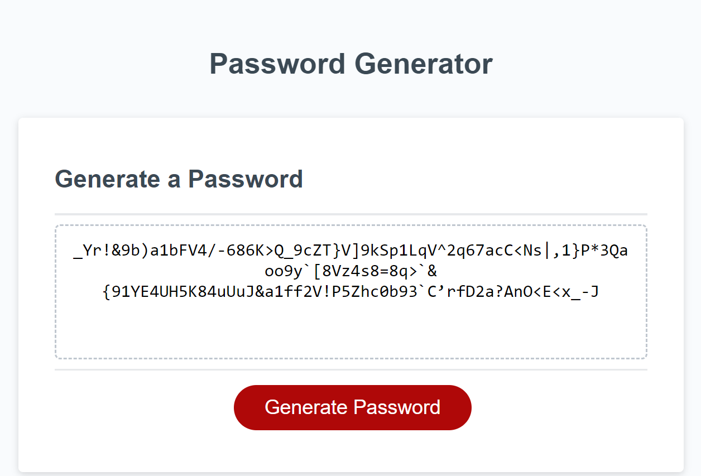

# 03 JavaScript: Password Generator


## Description

Randomly generate passwords that meet certain criteria:
- between 8 and 128 characters
- contains at least one uppercase letter, lowercase letter, number, or symbol
- input is validated

<br />

## User Story

```
AS AN employee with access to sensitive data
I WANT to randomly generate a password that meets certain criteria
SO THAT I can create a strong password that provides greater security
```


## Acceptance Criteria

```
GIVEN I need a new, secure password
WHEN I click the button to generate a password
THEN I am presented with a series of prompts for password criteria
WHEN prompted for password criteria
THEN I select which criteria to include in the password
WHEN prompted for the length of the password
THEN I choose a length of at least 8 characters and no more than 128 characters
WHEN asked for character types to include in the password
THEN I confirm whether or not to include lowercase, uppercase, numeric, and/or special characters
WHEN I answer each prompt
THEN my input should be validated and at least one character type should be selected
WHEN all prompts are answered
THEN a password is generated that matches the selected criteria
WHEN the password is generated
THEN the password is either displayed in an alert or written to the page
```

## Installation

N/A


## Usage

To randomly generate a password.

<br />

### Screenshot


<br />


## Credits

Tutor: Doug Kumagai:
<br />
https://www.linkedin.com/in/doug-kumagai/
<br />
https://github.com/ndesmic


mdn web docs: https://developer.mozilla.org/en-US/

JavaScript implementation of the Durstenfeld shuffle, an optimized version of Fisher-Yates: https://stackoverflow.com/questions/2450954/how-to-randomize-shuffle-a-javascript-array

[list of password special characters](https://www.owasp.org/index.php/Password_special_characters) from the OWASP Foundation.


## License

Please refer to the LICENSE in the repo.